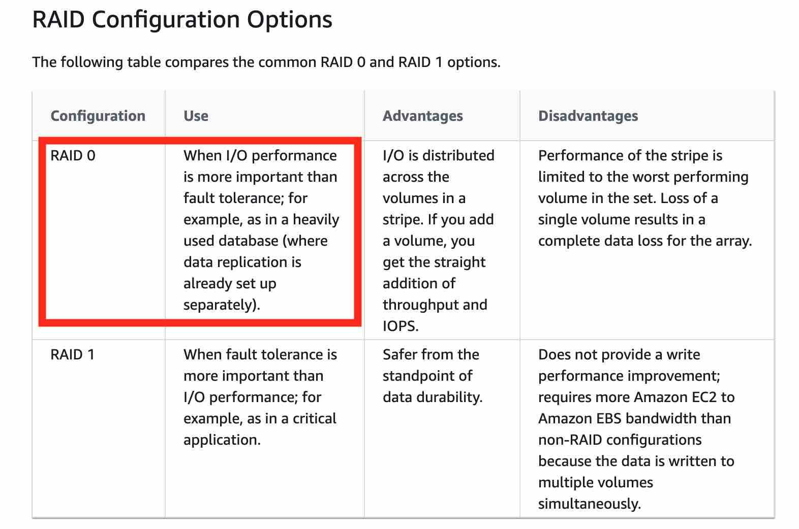

# EC2

 
<i>Menu</i>

- [EC2](#ec2-1)
- [Launch Template](#launch-template)
- [Launch Instance](#launch-instance)
- [User Data](#user-data)
- [EBS](#amazon-elastic-block-store-ebs)
- [Network Interface](#network-interface)

---
## EC2
- types:
  - Dedicated host
    - Enable to use existing server-bound software licenses like Windows Server.
  - Dedicated instances
    - share hardware with other instances from the same AWS account
  - On-demand instances
    - Pay, by the second, for the instances that you launch
  - on spot
    - price (0.0035$ per hour)
  - Reserved instances
    - Reduce your Amazon EC2 costs by making a commitment to a consistent instance configuration, including instance type and Region, for a term of 1 or 3 years
    - Regional Reserved instance (can't reserve capacity)
    - Zonal reserved instance (can reserve capacity)
  - Cluster group
    - same rack
    - logical grouping of instances within a single Availability Zone
    - Instances in the same cluster placement group enjoy a higher per-flow throughput limit of up to 10 Gbps for TCP/IP traffic and are placed in the same high-bisection bandwidth segment of the network
  - Partition placement group
    - 
  - Spread group
    - group of instances that are each placed on distinct racks, with each rack having its own network and power source
    - instances are placed across distinct underlying hardware to reduce correlated failures
    - can span multiple Availability Zones in the same Region
    - can have a maximum of __7 running__ instances per Availability Zone per group

---
## Launch Template
- Similar to launch configuration
- Specifies instance configuration information:
  - ID of the Amazon Machine Image (AMI)
  - Instance type (micro, etc...)
  - key pair
  - SG
  - ...
- Versioning
- Provision capacity across multiple instance types using both On-Demand Instances and Spot Instances

---
## Launch Instance
- It's an instance configuration template that an Auto Scaling group uses to launch EC2 instances.
- Specify:
  - ID of the AMI (Amazon Machine Image)
  - instance type
  - key pair
  - security group
- Can't modify a launch configuration once it is created!

---
## User Data
- By default, scripts entered as user data are executed with root user privileges
- By default, user data runs only during the boot cycle when you first launch an instance
- Update your configuration to ensure that your user data scripts and cloud-init directives run every time you restart your instance

---
## Amazon Elastic Block Store (EBS)
- By default, the root volume for an AMI backed by Amazon EBS is deleted when the instance terminates
- Non-root EBS volumes remain available even after you terminate an instance to which the volumes were attached
- For Encrypt EBS:
  - Data at rest inside the volume is encrypted
  - Any snapshot created from the volume is encrypted
  - Data moving between the volume and the instance is encrypted
    - Use KMS
- Cost 0.10$ per GB provisioned
- Does not support SMB
- It's confined to an Availability Zone and not by region
- RAID config:
  - 
- EBS multi attach in the same A-Z
  - up to 16 EC2 
  - only for io1/io2

---
## Network Interface
  - Elastic Network Interface (ENI)
    - logical networking component in a VPC that represents a virtual network card
  - Elastic Network Adapter (ENA)
    - support enhanced networking via single root I/O virtualization (SR-IOV) to provide high-performance networking capabilities
  - Elastic Fabric Adapter (EFA)
    - ENA
    - Plus a new OS bypass hardware interface that allows user-space applications to communicate directly with the hardware-provided reliable transport functionality.

---
## Retrieve instance metadata or user data
- ipv4
  - http://169.254.169.254/latest/meta-data/
  - http://169.254.169.254/latest/user-data
- ipv6
  - http://[fd00:ec2::254]/latest/meta-data/
  - http://[fd00:ec2::254]/latest/user-data