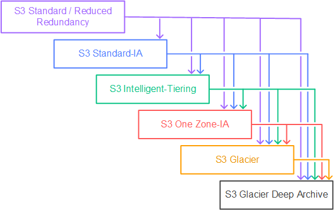

# S3

 
<i>Menu</i>

- [security](#security)
- [Public access](#public-access)
- [version](#version)
- [Replication](#replication)
- [Storage classes](#storage-classes)
- [Lifecycle rules](#lifecycle-rules)
- [Requester pays](#requester-pays)
- [Event notifications](#event-notifications)
- [Performance](#performance)
- [Select & Glacier Select](#select--glacier-select)
- [Batch operation](#batch-operation)
- [Advanced Security](#security-1)
- [Analytics Storage](#s3-analytics-storage)

---
## Basic
### security
- IAM policies
- bucket policies
- object access control list (ACL)
- bucket access control list
- encryption
### Public access
- static website
  - allow public access
  - enable static website under properties
  - add policy to allow public getObject
### version
### Replication
- Delete no replicate
- no chaining
- Same-Region Replication (SRR) and Cross-Region Replication (CRR) can be configured at the S3 bucket level, a shared prefix level, or an object level using S3 object tags
### Storage classes
- Standard - general purpose
- standard - infrequent access
  - minimum storage duration charge is 30 days
- Intelligent tiering
- One zone - infrequent access
  - Unlike other S3 Storage Classes which store data in a minimum of three Availability Zones (AZs), S3 One Zone-IA stores data in a single AZ and costs 20% less than S3 Standard-IA
  - minimum storage duration charge is 30 days
- Glacier instant retrieval
  - minimum storage duration charge is 90 days
- Glacier flexible retrieval
- Glacier deep archive
  - retrieval within 12 hours (48h with bulk to reduce the cost)
- The minimum storage duration is __30 days__ before you can transition objects

- S3 Object Ownership

---
## Advanced
### Lifecycle rules
- transition actions
- expiration actions
### Requester pays
- requester must be known by aws
### Event notifications
- SQS
  - not __FIFO__
- SNS
- Lambda
- EventBridge -> 18 others aws services & more advanced filtering, multiple destination,...
### Performance
- 3500 put/copy/post/delete & 5500 get/head request per second per prefix in a bucket
- Multi-part upload
  - object size over 100MB
- S3 Transfer acceleration
  - Enables fast, easy, and secure transfers of files over long distances between your client and an S3 bucket.
  - pay only for transfers that are accelerated
- Byte-Range fetch
### Select & Glacier Select
- server-side filtering
### Batch operation

---
## Security
- Encryption
  - SSE
    - SSE-S3
    - SSE-KMS
    - SSE-c
  - Client-side encryption
- Encryption in transit (SSl/TLS)
  - Force ssl/tls -> policy aws:SecureTransport
- Cors
- MFA delete (AWS CLI)
- Access logs
- Pre-signed URLs
- Glacier Vault Lock (__WORM model__ (Write once read many))
- Object Lock
  - Retention mode - Compliance
  - Retention mode - Governance
  - Legal Hold
- Access Points
  - Simplify policy in s3
- Object Lambda
- __S3 sync cmd__
  - Use CopyObject APIs to copy objects between S3 buckets

---
## S3 Analytics Storage
- Analyze storage access patterns to help you decide when to transition the right data to the right storage class
- transition less frequently accessed STANDARD storage to the STANDARD_IA
  - Storage class analysis does not give recommendations for transitions to the ONEZONE_IA or S3 Glacier storage classes

## URL
- http://bucket-name.s3-website.Region.amazonaws.com
- http://bucket-name.s3-website-Region.amazonaws.com