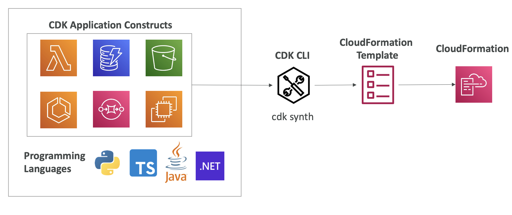
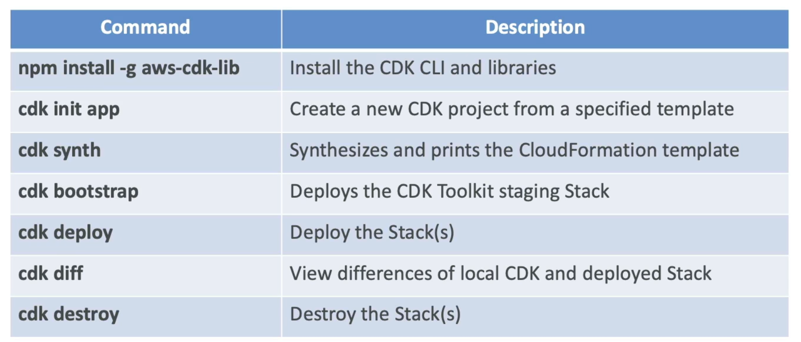

# AWS Cloud Development Kit

 
<i>Menu</i>

- [CDK](#cdk)

---
## CDK
- Define your cloud infrastructure using a familiar language
- Contains high level components called __constructs__
- The code is “compiled” into a CloudFormation template (JSON/YAML)
- 
- cmd
  - 
- Test
  - To import a template
    - Template.fromStack(MyStack) : stack built in CDK
    - Template.fromString(mystring) : stack build outside CDK

