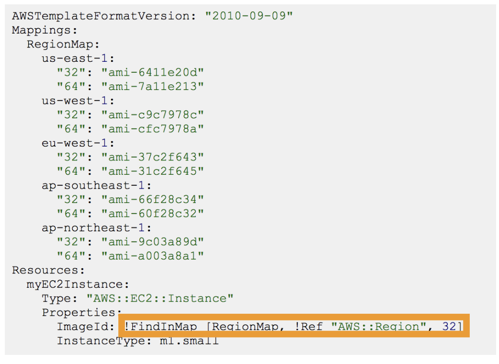
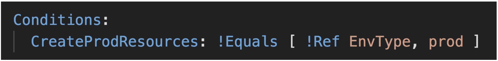
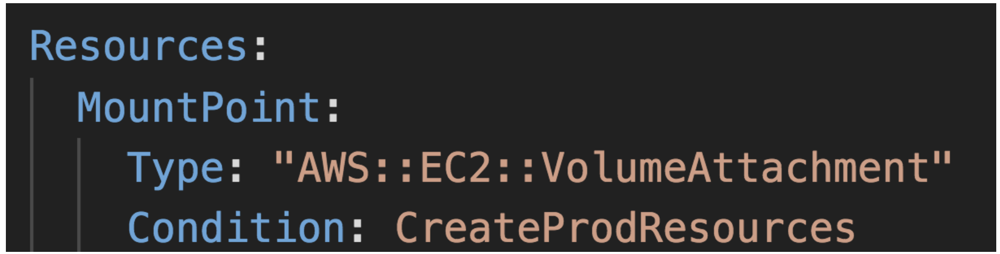

# Cloudformation

 
<i>Menu</i>

- [Cloudformation](#cloudformation-1)

---
## Cloudformation
- Resources
- Parameters
  - !Ref
- Pseudo-partameters
  - AWS::AccountId
- Mappings
  - FindInMap
  - 
- Outputs
  - export
  - !ImportValue
- Conditions
  - Fn::And
  - Fn::Or
  - Fn::If
  - Fn::Not
  - Fn::Equals
  - 
  - 
- Other functions
  - Fn::Sub
  - Fn::Join
- ChangeSet
  - to see the next modification of the stack before apply
- Stack type
  - Nested stacks
  - Cross stacks
  - StackSet -> share between Multiple AWS account
- Drift
  - Detect manual modification of the stack
- Stack policies
  - if activated, DENY * by default and need ALLOW in policies
