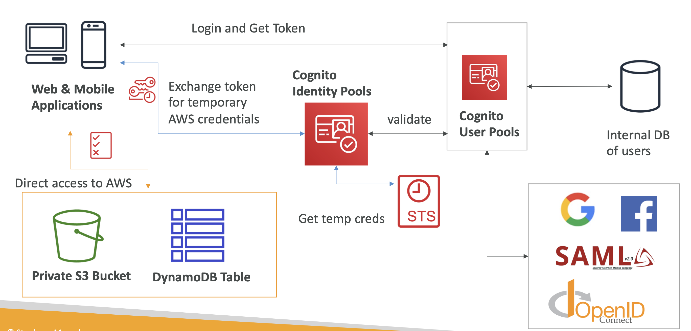

# AWS Cognito

 
<i>Menu</i>

- [Cognito](#cognito)

---
## Cognito
- User Pools
- Identity Pools
  - Access AWS services directly
- Cognito vs IAM
- STS
  - generate temporary credentials
- Cognito integrate with
  - API Gateway
  - ALB
- 
