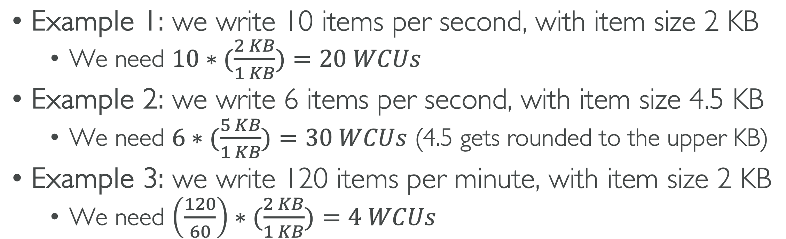
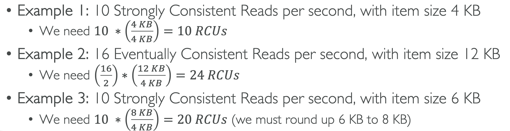

# DynamoDB

 
<i>Menu</i>

- [DynamoDB](#dynamodb)

---
## DynamoDB
- Tables
  - Maximum size of an item 400 KB
- PK
- schema can evolve rapidly
- Read/Write capacity
  - Provisioned Mode
    - predictable application traffic
    - traffic is consistent or ramps gradually
    - can forecast capacity requirements to control costs
  - On-Demand Mode
    - unpredictable application traffic
    - new tables with unknown workloads
    - ease of paying for only what you use
- DAX
  - Does not support SQL query caching
- Stream Processing
  - DynamoDB Streams
  - Kinesis Data Streams
- Global Tables (multiple-regions)
  - Must enable DynamoDB Streams
- TTL
- Disaster recovery
  - Continuous backups using point-in-time recovery PITR
  - On-Demand
- Integration with S3
  - Export
  - Import
- By default, all DynamoDB tables are encrypted under an AWS owned customer master key (CMK), which do not write to CloudTrail logs
- RCU/WCU
  - Write Capacity Units (WCU)
    - one write per second for an item up to 1 KB in size
    - 
  - Read Capacity Units (RCU)
    - Strongly Consistent Read
      - Consumes twice the RCU
    - Eventually Consistent Read (default)
    - One Read Capacity Unit (RCU) represents one Strongly Consistent Read per second, or two Eventually Consistent Reads per second, for an item up to 4 KB in size
    - 
- Optimistic Locking
- DynamoDB Streams
  - Data Retention for up to 24 hours
  - information that will be written to the stream
    - KEYS_ONLY
    - NEW_IMAGE
    - OLD_IMAGE
    - NEW_AND_OLD_IMAGES
