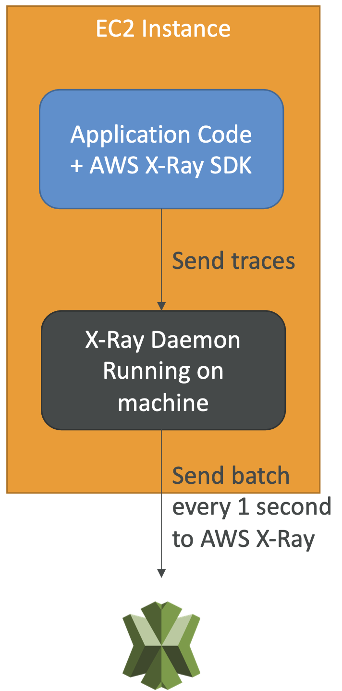

# Monitoring & Audit

 
<i>Menu</i>

- [CloudWatch](#cloudwatch)
- [EventBridge](#eventbridge)
- [Cloudwatch container Insight](#cloudwatch-container-insight)
- [Cloudwatch lambda Insight](#cloudwatch-lambda-insight)
- [Cloudwatch Contributor Insight](#cloudwatch-contributor-insight)
- [Cloudwatch Application Insight](#cloudwatch-application-insight)
- [CloudTrail](#cloudtrail)
- [AWS Config](#aws-config)

---
## CloudWatch
- Streams Metric
- every 5 min (default)
- enable details metric to get every minute
- enable High to get custom every second, 10s, 30s, X times 60s
- Logs
  - Insight
  - S3 export
    - up to 12 hours
  - Subscription
    - real-time to
      - lambda
      - kinesis data stream
      - kinesis data firehose
    - filter
- CloudWatch logs Agent
  - only logs
- Cloudwatch Unified Agent
  - logs + information of server (CPU, Disk, RAM, Netstat, swap)
- Alarms
  - Targets
    - EC2 : can automatically stop, terminate, reboot, or recover your EC2 instances
    - ASG
    - SNS
  - minim 10s to 30s

---
## EventBridge
- Schedule cron jobs
- cross account capability
- Advanced filtering
- Multiple destinations
- Capabilities:
  - Archive
  - replay events
  - Reliable delivery
- Outputs => Over 18 AWS services

---
## Cloudwatch container Insight
- Collect, aggregate, summarize metrics and logs from containers
- using containerized version of cloudwatch agent to discover containers

---
## Cloudwatch lambda Insight
- Monitoring and troubleshooting solution for serverless applications running on AWS Lambda
- Collects, aggregates, and summarizes diagnostic information such as cold starts and Lambda worker shutdowns

---
## Cloudwatch Contributor Insight
- Identify the heaviest work network users

---
## Cloudwatch Application Insight
- Provides automated dashboards that show potential problems with monitored applications, to help isolate ongoing issues

---
## CloudTrail
- GET history of events / API calls made within your AWS Account by:
  - SDK
  - Console
  - CLI
  - AWS services
- Events
  - Management Events
    - Read events
    - Write events
    - enable By default
  - Data events
    - disable By default
  - Insights Events
- Events Retention
  - Stored 90 days
  - Send to S3
- outputs:
  - S3
  - Cloudwatch

---
## AWS Config
- config rules per region
- could add remediation
- Can send Notifications

---
## X-RAY
- Debugging
- To enable
  - AWS X-Ray SDK in the code
  - Run X-Ray daemon or X-Ray AWS integration
  - 
- Simple Rules
  - reservoir
  - rate
- API
  - Write
    - PutTraceSegments
    - PutTelemetryRecords
    - GetSamplingRules
    - GetSamplingTargets & GetSamplingStatisticSummaries (advanced)
  - Read
    - GetServiceGraph
    - BatchGetTraces
    - GetTraceSummaries
    - GetTraceGraph
- segment
- subsegment
- annotation
- metadata (not indexed)

---
## AWS Distro for Open Telemetry
- X-Ray but open source
- __Able to send traces to multiple destination simultane ously__
