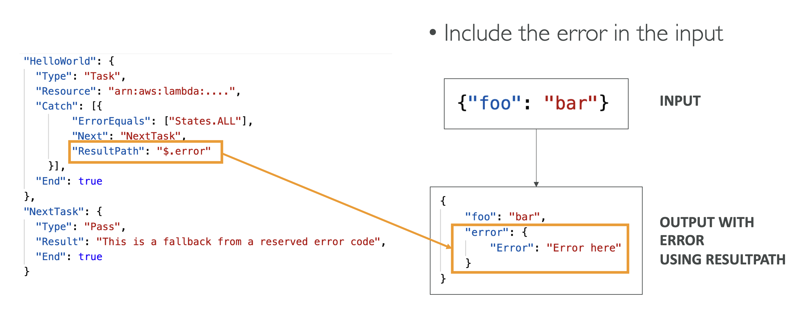
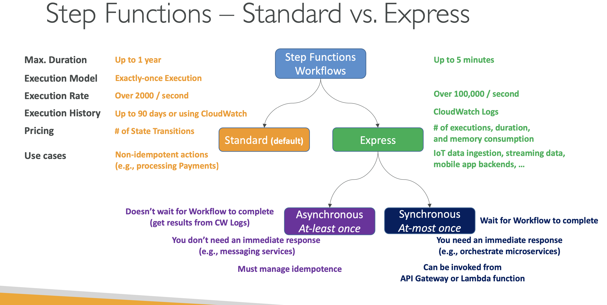

# Other Serverless

 
<i>Menu</i>

- [Step Functions](#step-functions)
- [AppSync](#AppSync)
- [Amplify](#Amplify)
- [STS](#STS)

---
## Step Functions
- Workflow to orchestrate lambda functions
- Human interaction can be a step
- States
  - Choice State - Test for a condition to send to a branch
  - Fail or Succeed State - Stop execution with failure or success
  - Pass State - Simply pass its input to its output or inject some fixed data, without performing work.
  - Wait State - Provide a delay for a certain amount of time or until a specified time/date.
  - Map State - Dynamically iterate steps. 
  - Parallel State - Begin parallel branches of execution.
- Retry
  - ErrorEquals: match a specific kind of error
  - Inter valSeconds: initial delay before retrying
  - BackoffRate: multiply the delay after each retry
  - MaxAttempts: default to 3, set to 0 for never retried
- Catch
  - ErrorEquals: match a specific kind of error
  - Next: State to send to
  - ResultPath - A path that determines what input is sent to the state specified in the Next field.
  - 
- Activity Task
- Wait for Task Token
- Standard vs Express
  - 

---
## AppSync
- GraphQl
- real time
- security
  - API_KEY
  - AWS_IAM
  - OPENID_CONNECT
  - AMAZON_COGNITO_USER_POOLS
- For custom domain & HTTPS, use CloudFront in front of AppSync

---
## Amplify
- Tools to create web/mobile application
- studio
- hosting
- Important features
  - authentication
  - datastore
  - testing
    - cypress E2E

---
## STS
- security token service
- AssumeRole
- GetSessionToken
- aws:MultiFactorAuthPresent:true
