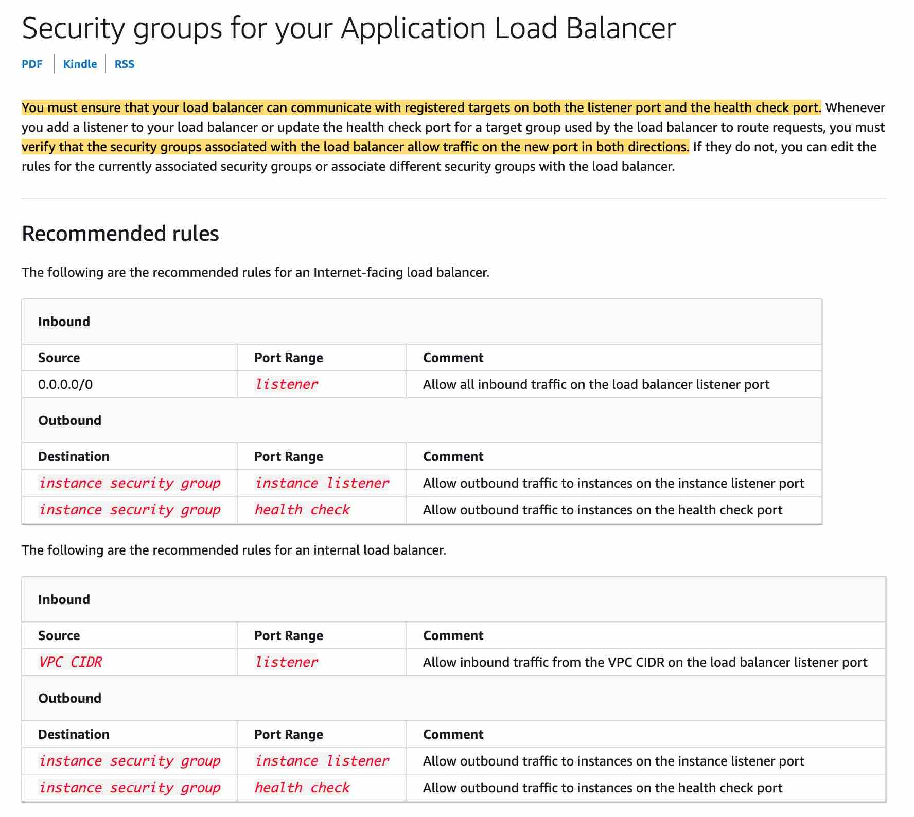
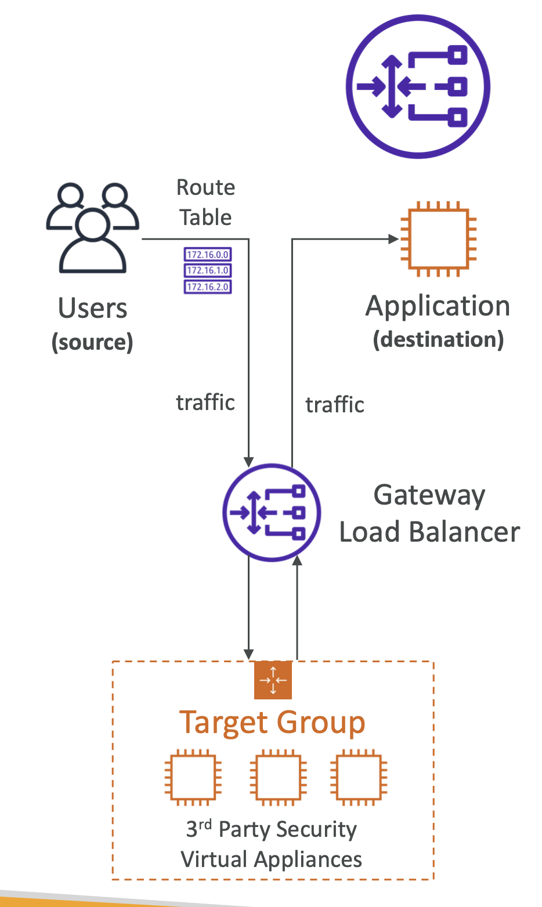
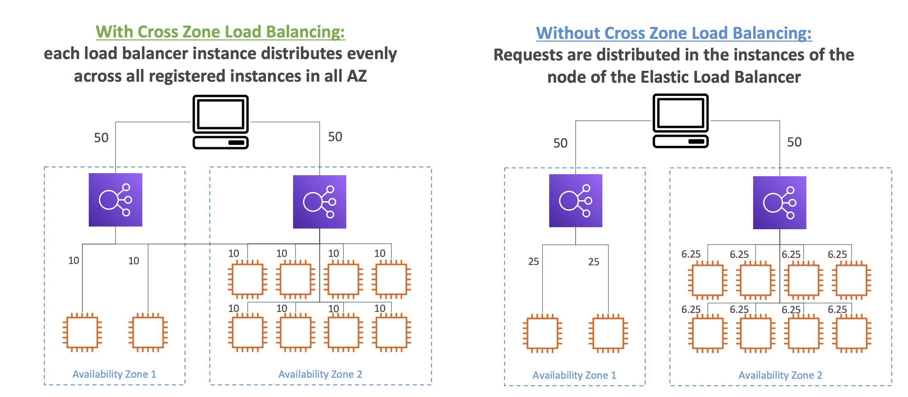

# Load Balancer

 
<i>Menu</i>

- [ALB](#application-load-balancer-alb)
- [NLB](#network-load-balancer-nlb)
- [GLB](#gateway-load-balancer-glb)
- [ELB](#elastic-load-balancer-elb)
- [ASG](#auto-scaling-group-asg)

---
## Application Load Balancer (ALB)
- security group

- ALB cannot use EC2 based health checks

---
## Network Load Balancer (NLB)

---
## Gateway Load Balancer (GLB)
- GENEVE protocol 6081

---
## Elastic Load Balancer (ELB)
- sticky Session
  - Application-based Cookies
  - Duration-based Cookies
- Cross zone
    - ALB default
    - NLB (not free)

- SSL
- Connection Draining
  - This enables the load balancer to complete in-flight requests made to instances that are de-registering or unhealthy
- three possible target types: 
  - Instance
  - IP
  - Lambda

---
## Auto Scaling group (ASG)
- [Launch template](../EC2/README.md#launch-template) 
- Dynamic scaling policies
  - Target tracking scaling
    - based on an Amazon CloudWatch metric
    - and a target value
  - Step scaling
    - base on a set of scaling adjustments that vary based on the size of the alarm breach
  - simple 
    - based on a single scaling adjustment, with a cool down period between each scaling activity
  - scheduled Action
    - scaling action at a certain designated hour
- Predictive Scaling
  - predictive scaling
- Standby mode to update some software
- ReplaceUnhealthy (can be suspended)
- Termination policy:
  1. Any allocation strategy for On-Demand vs Spot instances
  2. instance that uses a launch configuration
  3. instance with the oldest launch template
- Across multiple Availability Zones within a Region
