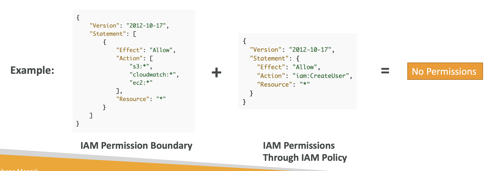

# IAM

 
<i>Menu</i>

- [IAM section](#iam-section)
- [IAM Roles](#iam-roles)
- [AWS Organisation](#aws-organisation)
- [IAM Conditions](#iam-conditions)
- [Roles vs Policies](#iam-roles-vs-resource-based-policies)
- [IAM Permission boundaries](#iam-permission-boundaries)
- [IAM Identity Center](#iam-identity-center)
- [AWS Directory Services](#aws-directory-services)
- [AWS Control Tower](#aws-control-tower)

---
## IAM Section

- Don’t use the root account except for AWS account setup
- One physical user = One AWS user
- Assign users to groups and assign permissions to groups
- Create a strong password policy
- Use and enforce the use of Multi-Factor Authentication (MFA)
- Create and use Roles for giving permissions to AWS services
- Use Access Keys for Programmatic Access (CLI / SDK)
- Audit permissions of your account using IAM Credentials Report & IAM Access Advisor

- Users: mapped to a physical user, has a password for AWS Console
- Groups: contains users only
- Policies: JSON document that outlines permissions for users or groups • Roles: for EC2 instances or AWS services

---
## IAM Roles
- Delegate access to users or services that normally don't have access to your organization's AWS resources
- IAM users or AWS services can assume a role to obtain temporary security credentials that can be used to make AWS API calls
- it is possible to access cross-account resources

---
# IAM Advanced

---

ex: IAM role that you create for the Lambda function is in the same AWS account as the bucket, then you don't need to grant Amazon S3 permissions on both the IAM role and the bucket policy.

---
## AWS Organisation
- Consolidated billing across account
- __Shared reserved instances and saving plans__
- Security: Service Control Policies (SCP)
- Organisation Unit

---
## IAM Conditions
- aws:SourceIp
- aws:RequestedRegion
- ec2:ResourceTag
- aws:MultiFactorAuthPresent
- aws:PrincipalOrgID

---
## IAM Roles vs Resource Based Policies
- Using a role as proxy
- EventBridge - Security
  - Rules:
    - Resource-base policy
    - IAM role

---
## IAM Permission boundaries
- for users & roles (not groups)

---
## Trust policy
- define which principal entities (accounts, users, roles, and federated users) can assume the role.

---
## IAM Identity Center
- Replace SSO
- Fine-grained Permissions and Assignments
  - Multi-Account Permissions
  - Application Assignments
  - Attribute-base Access Control (ABAC)

---
## AWS Directory Services
- Managed Microsoft AD
  - Microsoft Windows Server Active Directory (AD), managed by AWS
  - \> 5000 user
  - trust relationships
- AD Connector
  - Just a proxy to on-prem AD
  - simply connects your existing on-premises Active Directory to AWS
- Simple AD
  - subset of the features offered by AWS Managed
  - does not support features such as trust relationships with other domains
  - less than 5000 user
- Amazon Cloud Directory
  - cannot use it to establish trust relationships with other domains on the on-premises infrastructure

---
## AWS Control Tower
- Set up and govern a secure and compliant multi-account based on best practices
- Guardrails
  - Preventive Guardrail - using SCP
  - Detective Guardrail - using AWS Config