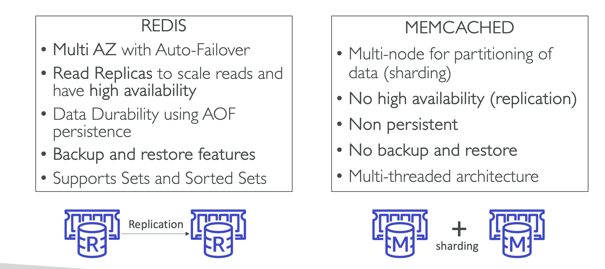

# Manage database

 
<i>Menu</i>

- [RDS](#relational-database-service-rds)
- [Aurora](#aurora)
- [ElastiCache](#elasticache)

---
## Relational Database Service (RDS)
- SQL as a query language
- database types:
  - Mysql
  - postgres
  - Microsoft sql server
  - oracle
  - Maria DB
- Read replicas
- Multi AZ
- __BUT you can’t SSH into your instances__
- Storage Auto Scaling
  - You have to set Maximum Storage Threshold (maximum limit for DB storage)
- Up to 15 Read Replicas
  - Applications must update the connection string to leverage read replicas
- Read Replicas within the same region, you don’t pay that fee
- Backup
  - Automatic (database backup)
    - up to 35 days
  - Manual (snapshot)
    - as long as we want
- Restore
  - create a new database
    - restore from S3

---
## Aurora
- Custom Endpoint
- 15 Aurora Replicas can be distributed across the Availability Zones that a DB cluster spans within an AWS Region
- Auto-scaling
- Costs more than RDS (20% more) – but is more efficient
- serverless (for unpredictable workload)
- Multi-Master
- Global Aurora (less than 1sec to replicate cross-region)
- Machine learning
- Backup
  - Automatic (database backup)
    - up to 35 days
  - Manual (snapshot)
    - as long as we want
- Restore
  - create a new database
    - restore from S3
- Cloning
  - faster than snapshot & restore
  - Useful to create a “staging” database from a “production” database without impacting the production database

---
## Security RDS & Aurora
- At-rest encryption
- In-flight encryption: TLS - ready by default
- IAM Authentication: IAM roles to connect to your database
- Security Groups
- No SSH available except on RDS Custom
- Audit Logs can be enabled and sent to CloudWatch Logs for longer retention

---
## Proxy
- Improving database efficiency by reducing the stress on database resources (e.g., CPU, RAM) and minimize open connections (and timeouts)
- Supports RDS (MySQL, Postgres, MariaDB, MS SQL Server) and Aurora (MySQL, Postgres)
- RDS Proxy is never publicly accessible (must be accessed from VPC)
- Enforce IAM Authentication for DB, and securely store credentials in AWS Secrets Manager

---
## ElastiCache
- Using ElastiCache involves heavy application code changes
- blazing fast in-memory data store that provides sub-millisecond latency to power internet-scale real-time applications
- Redis
- Memcached
- Security
  - IAM authentication for Redis
  - IAM policies only for API-level security
  - Redis AUTH
    - password/user
    - ssl in flight
  - Memcached
    - SASL-based authentication

