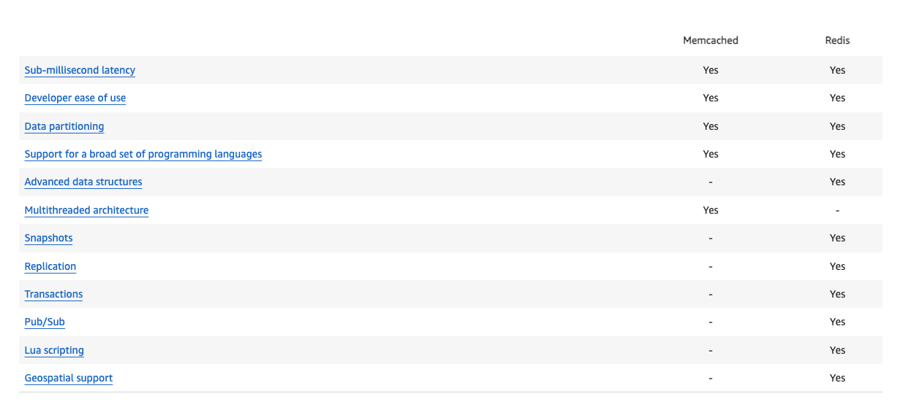

# Manage database

 
<i>Menu</i>

- [RDS](#rds)
- [Aurora](#aurora)
- [ElasticCache](#elasticcache)

---
## RDS
- Mysql
- postgres
- Microsoft sql server
- oracle
- Maria DB

---
## RDS Read replicas

---
## RDS Multi AZ

---
## Aurora

 - Custom Endpoint
 - 15 Aurora Replicas can be distributed across the Availability Zones that a DB cluster spans within an AWS Region
-
- Auto-scaling
- Global Aurora (less than 1sec to replicate cross-region)
- Machine learning

---
## Backup / restore

- Automatic
    - up to 35 days
- Manual
  - as long as we want

---
## clone

---
## security

---
## proxy

---
## ElasticCache

- blazing fast in-memory data store that provides sub-millisecond latency to power internet-scale real-time applications
- redis
  - Auth
- memcache

