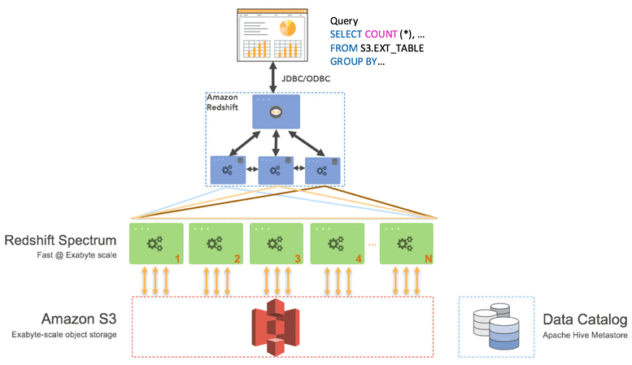

# Data Analytics

 
<i>Menu</i>

- [Athena](#athena)
- [Redshift](#redshift)
- [OpenSearch](#opensearch-elasticsearch)
- [EMR](#amazon-elastic-mapreduce-emr)
- [QuickSight](#quicksight)
- [Glue](#glue)
- [Lake Formation](#lake-formation)
- [Kinesis Data Analytics](#kinesis-data-analytics)
- [Amazon MSK](#amazon-msk-managed-streaming-for-apache-kafka)

---
## Athena
- BI
- Analytic
- Reporting
- Improve Performance
  - Columnar data
  - Compress data
  - Partition dataset in S3
  - Use larger files (>128 MB)
- Federated Query
  - Use lambda (data source connector) to run sql queries across data stored

---
## Redshift
- Must load data first before queries
  - Kinesis Data Firehose
  - S3 using Copy command
  - EC2 Instance
- Snapshots & DR
- Spectrum
  - Query data that is already in S3 without loading it
  

---
## OpenSearch (ElasticSearch)
- 2 modes
  - Managed cluster
  - Serverless cluster
- Queries with partial matches

---
##  Amazon Elastic MapReduce (EMR)
- Hadoop clusters (Big Data)
- Cluster can be made hundreds of EC2
- Auto-scaling (with spot instance)
- Nodes types
  - Master Node
  - Core Node
  - Task node (usually spot)

---
## QuickSight
- BI dashboard
- Serverless
- could be embedded
- In memory computation using SPICE
- Column-level security (CLS)
- Define Users

---
## Glue
- ETL
- Convert data into Parquet format
- Glue Data Catalog
  - Glue Data Crawler
- Glue job Bookmarks
- Glue Elastic Views
- Glue DataBrew
- Glue Studio (GUI)
- Glue Streaming ETL

---
## Lake Formation
- Store in S3

---
## Kinesis Data Analytics
- For SQL applications
- For apache Flink

---
## Amazon MSK (Managed Streaming for apache kafka)
- Big Data

