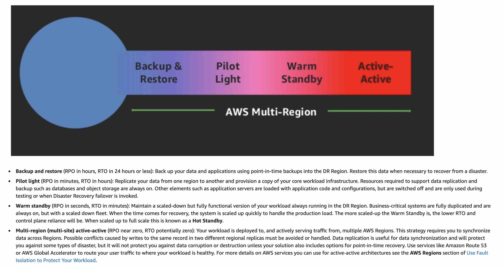
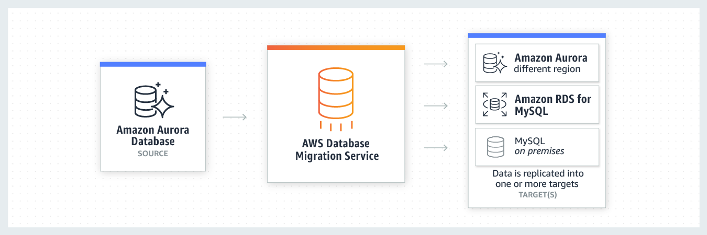

# Disaster & Recovery

 
<i>Menu</i>

- [Strategies](#strategies)
- [DMS](#dms---database-migration-service)
- [Migrate On-Premise with AWS](#migrate-on-premise-with-aws)
- [AWS Backup](#aws-backup)
- [Application Discovery Service](#disaster--recovery)
- [MGM](#application-migration-service-mgm)
- [Vmware cloud](#vmware-cloud-on-aws)
- [Transfer large amount of data](#transfer-large-amount-of-data)

- Recovery Point Objective (RPO)
  - how often backups
- Recovery Time Objective (RTO)
  - Time to restore the system

---
## Strategies
- Backup & Restore (High RPO)
  - RPO in hours
- Pilot Light
  - a minimal version of an environment is always running in the cloud
  - RPO/RTO is in 10s of minutes
- Warm standby
  - scaled-down version of a fully functional environment is always running
- Multi Site / Hot Site Approach
  - an active-active configuration
- AWS Multi Region

---
## DMS - Database Migration Service
- Must create EC2 to perform the replication
- If from SQL Server to Mysql need of AWS Schema Conversion Tool (SCT)
- Continuous Replication
- Multi-AZ
- RDS & Aurora MySQL Migration
  - RDS MySQL to Aurora
    - snapshot
    - read replica
  - External MySQL to Aurora
    - Use Percona XtraBackup to create a file backup in S3
- Enables to migrate data (petabyte-scale) from supported sources to
  - relational databases
  - data warehouses
  - streaming platforms (Kinesis, ...)
  - other data stores in AWS cloud (S3)
- Source database remains fully operational during the migration
- Basic Schema Copy
  - Automatically create tables and primary keys in the target instance
  - will not migrate secondary indexes, foreign keys or stored procedures
- continuous-data-replication:

The Amazon Redshift cluster must be in the same AWS account and the same AWS Region as the replication instance. During a database migration to Amazon Redshift, AWS DMS first moves data to an Amazon S3 bucket. When the files reside in an Amazon S3 bucket, AWS DMS then transfers them to the proper tables in the Amazon Redshift data warehouse. AWS DMS creates the S3 bucket in the same AWS Region as the Amazon Redshift database. The AWS DMS replication instance must be located in that same region.

---
## Migrate On-Premise with AWS
- VM import/export
- Application Discovery service
- DMS
- Server Migration Service (SMS)

---
## AWS Backup
- Fully managed service
- Centrally manage and automate backups across AWS services
- Vault lock policy (WORM) write once read many

---
## Application Discovery Service
- 2 types of migrations
  - Agent-less Discovery
  - Agent-based Discovery

---
## Application Migration Service (MGM)
- Migrate application to AWS

---
## Vmware cloud on AWS

---
## Transfer large amount of data
- Over the internet / Site-to-Site VPN
- Over direct connect (1 Gbps)
- Over snowball
- For ongoing replication / transfers
