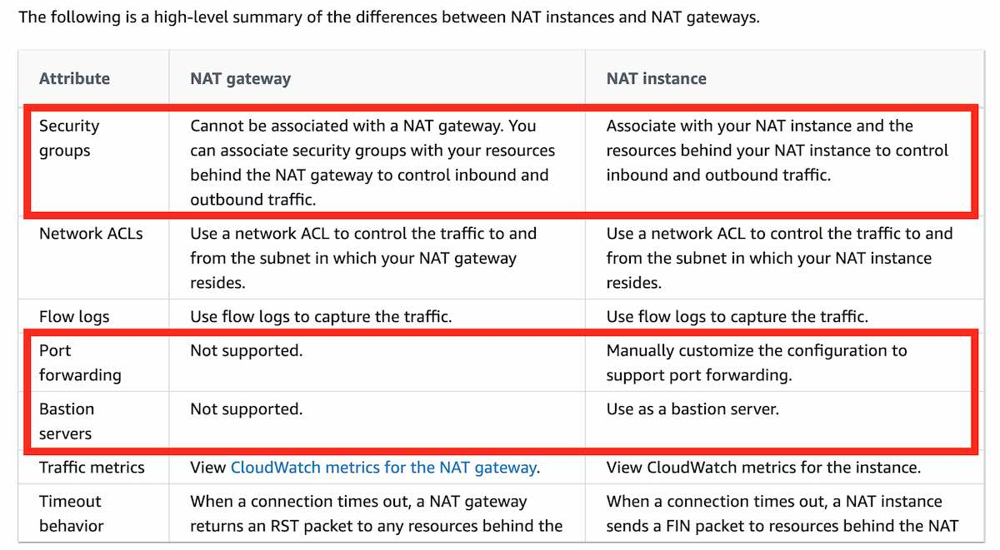

# VPC

 
<i>Menu</i>

- [CIDR](#cidr---ipv4)
- [Subnet](#subnet)
- [Internet Gateway](#internet-gateway)
- [Bastion Hosts](#bastion-hosts)
- [NAT Instance](#nat-instance-outdated)
- [NAT Gateway](#nat-gateway)
- [NACL](#network-access-control-list-nacl)
- [VPC sharing](#vpc-sharing)
- [VPC Peering](#vpc-peering)
- [VPC Endpoint](#vpc-endpoint-aws-privatelink)
- [VPC Flow Logs](#vpc-flow-logs)
- [Site-to-site VPN](#site-to-site-vpn)
- [VPN CloudHub](#vpn-cloudhub)
- [Direct Connect](#direct-connect-dx)
- [Transit Gateway](#transit-gateway)
- [VPC - Traffic Mirroring](#vpc---traffic-mirroring)
- [Egress-only Internet gateway](#egress-only-internet-gateway)
- [AWS Network Firewall](#aws-network-firewall)

---
## CIDR - IPV4
- Classless Inter-Domain Routing
- Base IP
- subnet Mask
  - /32 no octet can change
  - /24 last octet can change (/24 means = 2^(32-24) = 2^8 = 256 IPs)
  - /16 last 2 octets can change
  - /8 last 3 octets can change
  - /0 all octets can change
- Private vs Public
- CIDR block size must be between /16 and /28

---
## Subnet
- AWS reserves 5 IP addresses (first 4 & last 1) in each subnet
  - ex CIDR block 10.0.0.0/24 then aws ip reserved are
    - 10.0.0.0 - Network Address 
    - 10.0.0.1 - reserved AWS for VPC router 
    - 10.0.0.2 - reserved AWS for mapping to Amazon-provided DNS
    - 10.0.0.3 - reserved AWS for futur use
    - 10.0.0.255 - Network Broadcast Address 
- public
- private

---
## Internet Gateway
- One VPC can only connect one IGW
- Route tables must be edited

---
## Bastion Hosts
- Ec2 Instance in public subnet
- Security group must access internet
- Security group of the ec2 instance in private subnet must allow the bastion ec2 instance

---
## NAT Instance (outdated)
- Must disable Source/destination check
- support port forwarding
- can be used as Bastion

---
## NAT Gateway
- spécif AZ
- Private subnet => NATGW => IGW

---
## Network Access Control List (NACL)
- Like firewall
- One NACL per subnet
- Default NACL allow everything in & out
- New NACL deny everything in & out
- Rules allow or deny and are evaluated in order (lower to highest)

---
## VPC sharing
- share one or more subnets with other AWS accounts belonging to the same parent organization

---
## VPC Peering
- Privately connect 2 vpc's (even from cross account)
- Make them behave as if they were in same network
- CIDR must not overlap!

---
## VPC Endpoint (AWS PrivateLink)
- Every AWS is publicly exposed
- VPC endpoint  allow to connect AWS services using private network
- Types of endpoints
  - __Interface Endpoint__ (power by PrivateLink)
    - support everything
  - __Gateway Endpoint__ (prefer solution at exam)
    - only for s3 or dynamoDB

---
## VPC Flow Logs
- Capture information about IP traffic
  - VPC
  - subnet
  - ENI
- Syntax
  - srcaddr & dstaddr
  - srcport & dstport
  - Action
- To troubleshoot we check Action

---
## Site-to-site VPN
- VPN connection between enterprise and AWS
  - Virtual Private Gateway (VGW)
  - Customer Gateway (CGW)
- Enable Route Propagation in AWS
- For EC2 ssh enable ICMP protocol

---
## VPN CloudHub
- Provide secure communication between sites

---  
## Direct Connect (DX)
- Provides a dedicated private connection from remote network to your VPC
- Direct Connect Gateway
- Connection Types
  - Dedicated Connections
    - connection supports 1Gbps, 10Gbps and 100Gbps.
  - Hosted Connections
    - connection supports 50Mbps, 500Mbps, up to 10Gbps.
  - takes longer than 1 month to establish a new connection
- Encryption
  - not encrypt but it's private
  - Could add a vpn to encrypt
- Resiliency
- Backup connection through Site-toSite VPN
- Virtual Interface Firewall (VIF)
  - Public
    - AWS resources reachable by public IP
  - Private
    - AWS resources reachable using private IP
  - Transit
    - AWS resources reachable through a transit gateway using private IP

---
## Transit Gateway
- To scale up an AWS Site-to-Site VPN connection throughput
- Network transit hub that you can use to interconnect your virtual private clouds (VPC) and on-premises networks

---
## VPC - Traffic Mirroring
- Allow to capture and inspect network traffic in your vpc

---
## Egress-only Internet gateway
- Used for IPv6 only
- Similar to a NAT gateway but for IPv6
- Must update route tables

---
## AWS Network Firewall
- From layer 3 to Layer 7 protection
- Firewall at the VPC level
