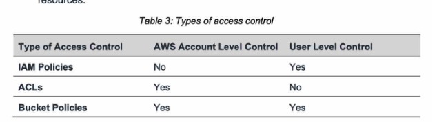

# Security

 
<i>Menu</i>

- [KMS](#aws-kms)
- [SSM](#ssm-parameter-store)
- [Secrets Manager](#aws-secrets-manager)
- [ACM](#certificate-manager-acm)
- [WAF](#waf)
- [Shield](#aws-shield)
- [Firewall Manager](#aws-firewall-manager)
- [GuardDuty](#guardduty)
- [Inspector](#inspector)
- [Macie](#macie)
- [Types of Access Control](#types-of-access-control)

---
- Encryption in flight (ssl)
- Server side encryption at rest
  - Data encrypted after being received by the server
- Client side encryption

---
## AWS KMS
- KMS Keys Types
  - Symmetric (AES-256 keys)
  - Asymmetric (RSA & ECC key pairs)
- KMS Key per region
  - AWS managed key
  - Customer managed keys
- Key Policies
  - Default
    - everyone could access it
  - Custom
- Key rotation
  - every year only
- KMS Multi-Region Keys
  - Are not Global
  - Each Multi-Region key is managed independently
  - Use cases: global client-side encryption, encryption Global DynamoDB or Global Aurora
- S3 replication encryption
  - SSE-S3 -> replicated by default
  - SSE-C -> never replicated
  - SSE-KMS -> need enable option
    - object will be decrypted then encrypted
- AMI Sharing Process Encrypted via KMS
  - Modify Launch Permission

---
## SSM Parameter Store
- For secrets and configuration management data
- Standard
  - free
- Advanced
  - policies available
    - TTL

---
## AWS Secrets Manager
- Could force rotation
- Multi-Region Secrets

---
## Certificate Manager (ACM)
- TLS Certificates
- both public or private
- free of charge for public
- API Gateway
  - Edge-Optimized (default)
    - __TLS certificate must be in the same region as Cloudfront in us-east-1__
  - Regional
    - TLS certificate must be imported on API Gateway, in the same region as the API Stage

---
## WAF
- Protect web app from common web exploits (Layer 7 is http)
- Deploy on
  - ALB
  - API Gateway
  - CloudFront
  - AppSync GraphQL API
  - Cognito User Pool

---
## AWS Shield
- Protect from DDOS
- Standard
  - free, already activated
- Advanced
  - dedicate support (3000$ per month)

---
## AWS Firewall Manager
- Manage rules in all accounts of an AWS organization
- security policy
  - WAF rules
  - Shield Advanced
  - SG for EC2

---
## GuardDuty
- Intelligent threat discovery to protect your AWS account
- Input:
  - CloudTrail events
  - VPC Flow
  - DNS Logs
- Can set up eventBridge for notification
- Can protect against CryptoCurrency attack

---
## Inspector
- Automated Security assessments
- For EC2
- For ECR
- For Lambda
- Report to aws security hub or eventBridge
- Risk score with all vulnerabilities

---
## Macie
- Identify and protect sensitive data, such as personally identifiable information (PII)
- can alert
- Input: S3

---
## Types of Access Control

- IAM 
  - Only grant users within your own AWS account permission to access AWS services
- ACL
  - Only grant other AWS accounts (not specific users) access to your Amazon resources
- Security Group
  - Acts as a virtual firewall for EC2 instances to control incoming and outgoing traffic
    - S3 does not support Security Groups