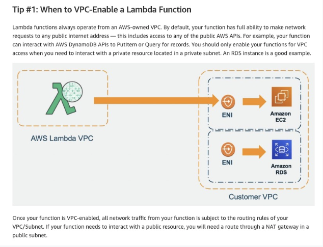

# Serverless

 
<i>Menu</i>

- [Lambda](#lambda)
- [DynamoDB](#dynamodb)
- [API Gateway](#api-gateway)
- [Step Functions](#step-functions)
- [Cognito](#cognito)

---
## Lambda
- short executions
- on-demand
- scaling is automated
- very cheap
- Limits
  - Execution
    - 128 MB to 10 GB
    - 15 min
    - env variables 4 KB
    - disk capacity 512 MB to 10 GB
    - Concurrency executions: 1000
  - Deployment
    - 50 MB compressed (.zip)
    - 250 MB uncompressed
    - Can use /tmp directory to load other files at startup
    - env variables 4 KB
- Lambda@Edge vs CloudFront function
- Lambda in VPC
- RDS Proxy
- Layer
  - a ZIP archive that contains libraries, a custom runtime, or other dependencies
  - let you keep your deployment package small
  - can use up to 5 layers at a time
- security IAM role

- Price 0.06$ per hour

---
## DynamoDB
- Tables
  - Maximum size of an item 400 KB
- PK
- schema can evolve rapidly
- Read/Write capacity
  - Provisioned Mode
    - predictable application traffic
    - traffic is consistent or ramps gradually
    - can forecast capacity requirements to control costs
  - On-Demand Mode
    - unpredictable application traffic
    - new tables with unknown workloads
    - ease of paying for only what you use
- DAX
  - Does not support SQL query caching
- Stream Processing
  - DynamoDB Streams
  - Kinesis Data Streams
- Global Tables (multiple-regions)
  - Must enable DynamoDB Streams
- TTL
- Disaster recovery
  - Continuous backups using point-in-time recovery PITR
  - On-Demand
- Integration with S3
  - Export
  - Import
- By default, all DynamoDB tables are encrypted under an AWS owned customer master key (CMK), which do not write to CloudTrail logs

---
## API Gateway
- websocket
- API versioning
- environment
- security
  - IAM roles
  - cognito
  - Custom Authorizer
  - HTTPS
- API keys
- swagger/openApi
- transform request
- generate SDK and API spec
- cache API response
- Endpoint Types
  - Edge-Optimized (default)
  - Regional
  - Private
- supports:
  - stateless RESTful APIs
  - stateful WebSocket APIs

---
## Step Functions
- Workflow to orchestrate lambda functions
- Human interaction can be a step

---
## Cognito
- User Pools
- Identity Pools
  - Access AWS services directly
- Cognito vs IAM
- STS
  - generate temporary credentials
